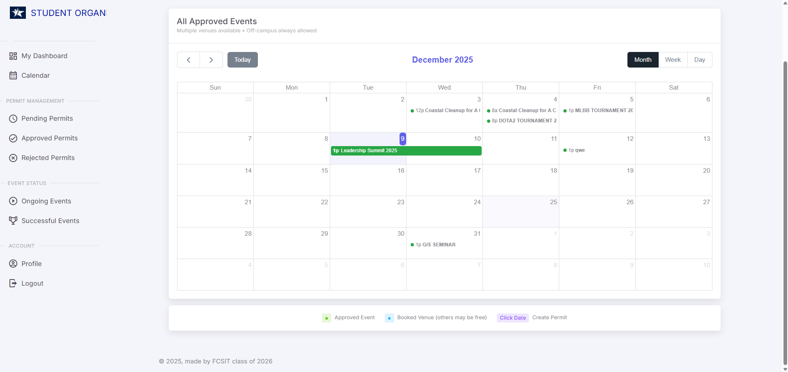
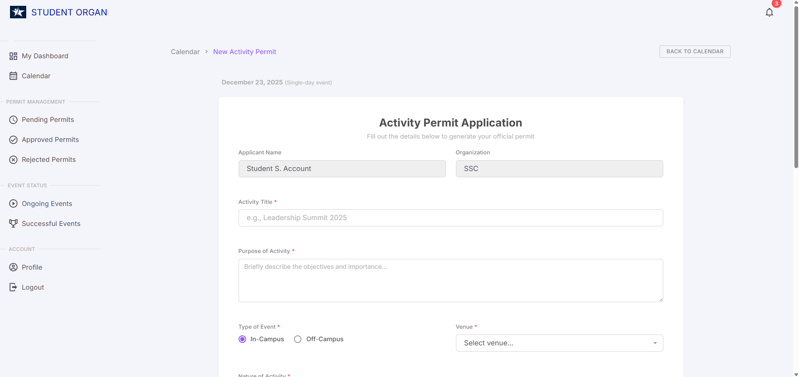

<p align="center">
   
   
   
</p>

<h1 align="center">
   📅 EMPS - Event Management & Permit System
</h1>

<p align="center">A comprehensive Laravel-based Event Management and Permit System designed for educational institutions to streamline event planning, approval workflows, and calendar management.</p>

<p align="center">
   
   
   
</p>

---

## 🌟 Introduction

**EMPS (Event Management & Permit System)** is a powerful, full-featured web application built with Laravel 10 and Materio Bootstrap Admin Template. It provides a complete solution for managing student organization events, handling multi-level approval workflows, venue bookings, and real-time calendar visualization.

Perfect for:
- 🎓 **Universities & Colleges** managing student organization events
- 🏢 **Student Affairs Offices** coordinating campus activities
- 👥 **Student Organizations** planning and tracking their events
- ✅ **Administrative Staff** streamlining approval processes

### ✨ Key Highlights

- **Multi-Role System** - Students, Advisers, OSA, VP for SAS, Admin
- **Smart Approval Workflow** - Role-based, sequential approval chain
- **Interactive Calendar** - Drag-to-select dates, visual event management
- **BARGO Integration** - Auto-approved events for official activities
- **Real-time Notifications** - Email & in-app notifications
- **PDF Generation** - Professional permit documents with digital signatures
- **Venue Management** - Conflict detection and availability checking
- **Document Upload** - Support for event requirements and attachments

---

## 📸 Screenshots

<details>
<summary>Click to view screenshots</summary>

### Student Dashboard


### Event Calendar with Date Selection


### Permit Application Form


### Approval Workflow


### BARGO Event Creation


</details>

---

## 🚀 Features

### 📋 Event Management
- ✅ Create and manage event permits
- ✅ In-Campus and Off-Campus event support
- ✅ Multi-day event scheduling
- ✅ Venue booking with conflict detection
- ✅ Attach documents and requirements
- ✅ Track event status in real-time

### 🔄 Approval Workflow
- ✅ Sequential multi-level approval chain
- ✅ Role-based approval routing (Adviser → OSA → VP_SAS)
- ✅ Comments and feedback system
- ✅ Email notifications at each approval stage
- ✅ Approve, revise, or reject permits
- ✅ Detailed audit trail

### 📅 Calendar System
- ✅ Interactive FullCalendar integration
- ✅ Click-and-drag date selection
- ✅ Color-coded events by organization
- ✅ BARGO events highlighted in orange
- ✅ Venue availability visualization
- ✅ Multiple calendar views (month, week, day)

### 🏛️ BARGO Module
- ✅ Auto-approved official events
- ✅ Instant visibility to all users
- ✅ Dedicated BARGO calendar
- ✅ Streamlined event creation
- ✅ No permit PDF required

### 📄 Document Management
- ✅ PDF permit generation with signatures
- ✅ Digital signature support
- ✅ Upload event requirements
- ✅ Downloadable approved permits
- ✅ Document versioning

### 👥 User Management
- ✅ Role-based access control (RBAC)
- ✅ Organization membership management
- ✅ User profiles with signatures
- ✅ Activity tracking
- ✅ Notification preferences

---

## 🛠️ Technology Stack

| Technology | Purpose |
|------------|---------|
| **Laravel 10** | Backend Framework |
| **PHP 8.2+** | Programming Language |
| **MySQL 8.0+** | Database |
| **Bootstrap 5** | Frontend Framework |
| **FullCalendar** | Interactive Calendar |
| **SweetAlert2** | Beautiful Alerts |
| **Flatpickr** | Date/Time Picker |
| **DomPDF** | PDF Generation |
| **Mailtrap/SMTP** | Email Notifications |
| **Materio Template** | Admin UI Theme |

---

## 📦 Installation

### Prerequisites

Before you begin, ensure you have the following installed:
- PHP >= 8.2
- Composer
- Node.js & NPM/Yarn
- MySQL >= 8.0
- Git

### Step-by-Step Installation

1. **Clone the repository**
```bash
git clone https://github.com/yourusername/emps.git
cd emps
```

2. **Install PHP dependencies**
```bash
composer install
```

3. **Install JavaScript dependencies**
```bash
npm install
# or
yarn install
```

4. **Environment setup**
```bash
cp .env.example .env
php artisan key:generate
```

5. **Configure your `.env` file**
```env
DB_CONNECTION=mysql
DB_HOST=127.0.0.1
DB_PORT=3306
DB_DATABASE=emps
DB_USERNAME=root
DB_PASSWORD=your_password

MAIL_MAILER=smtp
MAIL_HOST=smtp.mailtrap.io
MAIL_PORT=2525
MAIL_USERNAME=your_username
MAIL_PASSWORD=your_password
```

6. **Run migrations and seeders**
```bash
php artisan migrate --seed
```

7. **Link storage**
```bash
php artisan storage:link
```

8. **Compile assets**
```bash
npm run dev
# For production:
npm run build
```

9. **Start the development server**
```bash
php artisan serve
```

10. **Access the application**
```
http://localhost:8000
```

### Default Login Credentials

| Role | Email | Password |
|------|-------|----------|
| Admin | admin@emps.edu | password |
| VP_SAS | vpsas@emps.edu | password |
| OSA | osa@emps.edu | password |
| Adviser | adviser@emps.edu | password |
| Student | student@emps.edu | password |

---

## 📚 Database Structure

### Core Tables

- `users` - User accounts and authentication
- `user_profiles` - Extended user information
- `organizations` - Student organizations
- `members` - Organization membership
- `permits` - Event permit applications
- `venues` - Available event venues
- `event_approval_flows` - Approval workflow tracking
- `notifications` - User notifications

### Key Relationships

```
Users → Members → Organizations
Users → Permits → Event Approval Flows
Permits → Venues
Permits → Documents (attachments)
```

---

## 🎯 User Roles & Permissions

### 🎓 Student
- Submit event permit applications
- View organization events
- Track permit approval status
- Upload signature and documents
- Receive notifications

### 👨‍🏫 Adviser
- Review student permit requests
- Approve/revise/reject permits
- Add comments and feedback
- View organization calendar
- Manage advisee organizations

### 🏢 OSA (Office of Student Affairs)
- Review permits after adviser approval
- Second-level approval authority
- Monitor all campus events
- Venue conflict management
- Generate reports

### 👔 VP_SAS (Vice President for Student Affairs)
- Final approval authority
- View all campus activities
- BARGO event management
- System-wide oversight
- Policy enforcement

### ⚙️ Admin
- Full system access
- User management
- Organization setup
- Venue management
- System configuration

---

## 🔄 Approval Workflow

```
┌─────────────┐
│   Student   │
│  Submits    │
└──────┬──────┘
       │
       ▼
┌─────────────┐     ┌──────────┐
│   Adviser   │────►│  Reject  │
│   Reviews   │     └──────────┘
└──────┬──────┘
       │ Approve
       ▼
┌─────────────┐     ┌──────────┐
│     OSA     │────►│  Reject  │
│   Reviews   │     └──────────┘
└──────┬──────┘
       │ Approve
       ▼
┌─────────────┐     ┌──────────┐
│   VP_SAS    │────►│  Reject  │
│   Reviews   │     └──────────┘
└──────┬──────┘
       │ Approve
       ▼
┌─────────────┐
│  Approved   │
│   Event!    │
└─────────────┘
```

---

## 🎨 Key Features Walkthrough

### 1. Creating an Event Permit

1. Navigate to **Calendar** → Click/drag dates
2. View existing events and venue availability
3. Click **"Create Permit Request"**
4. Fill out the form:
   - Event title and purpose
   - Event type (In-Campus/Off-Campus)
   - Venue selection
   - Date and time
   - Participants and expected number
   - Upload requirements (if off-campus)
5. Review and submit
6. Generate PDF permit

### 2. BARGO Event Creation

1. Navigate to **BARGO Calendar**
2. Click/drag dates on calendar
3. Fill simplified form:
   - Event title
   - Venue
   - Description
4. Submit → Auto-approved instantly!

### 3. Approval Process

**For Approvers:**
1. View **Pending Permits** dashboard
2. Click permit to review details
3. Check venue conflicts
4. Add comments if needed
5. Choose action:
   - ✅ Approve
   - 🔄 Request Revision
   - ❌ Reject

---

## 📱 API Endpoints

<details>
<summary>Click to view API documentation</summary>

### Calendar Events
```
GET  /api/calendar/events          - Fetch all approved events
GET  /api/bargo/calendar/events    - Fetch BARGO events
POST /api/calendar/check-conflicts - Check venue availability
```

### Permits
```
GET    /permits                  - List user's permits
POST   /permits/generate         - Create new permit
GET    /permits/{id}             - View permit details
PUT    /permits/{id}/update      - Update permit
DELETE /permits/{id}             - Delete permit
```

### Approvals
```
GET  /approvals/pending          - Get pending approvals
POST /approvals/{id}/approve     - Approve permit
POST /approvals/{id}/revise      - Request revision
POST /approvals/{id}/reject      - Reject permit
```

</details>

---

## 🧪 Testing

Run the test suite:

```bash
# Run all tests
php artisan test

# Run specific test suite
php artisan test --testsuite=Feature

# Run with coverage
php artisan test --coverage
```

---

## 🔧 Configuration

### Email Configuration

Edit `.env`:
```env
MAIL_MAILER=smtp
MAIL_HOST=your-smtp-host
MAIL_PORT=587
MAIL_USERNAME=your-email
MAIL_PASSWORD=your-password
MAIL_ENCRYPTION=tls
MAIL_FROM_ADDRESS=noreply@emps.edu
MAIL_FROM_NAME="${APP_NAME}"
```

### Calendar Settings

Edit `config/calendar.php`:
```php
return [
    'default_view' => 'dayGridMonth',
    'first_day' => 0, // Sunday
    'business_hours' => [
        'start' => '08:00',
        'end' => '18:00',
    ],
];
```

---

## 📖 Documentation

- [User Guide](docs/USER_GUIDE.md)
- [API Reference](docs/API.md)
- [Deployment Guide](docs/DEPLOYMENT.md)
- [Contributing Guidelines](CONTRIBUTING.md)

---

## 🐛 Known Issues

- [ ] Calendar timezone handling for international users
- [ ] Mobile responsiveness on permit form
- [ ] Bulk permit approval feature pending

See [Issues](https://github.com/yourusername/emps/issues) for full list.

---

## 🗺️ Roadmap

### Version 1.1 (Q1 2025)
- [ ] Mobile application (React Native)
- [ ] Advanced reporting and analytics
- [ ] Email template customization
- [ ] Bulk operations for approvers

### Version 1.2 (Q2 2025)
- [ ] Multi-campus support
- [ ] SMS notifications
- [ ] Integration with student information systems
- [ ] Advanced calendar features (recurring events)

### Version 2.0 (Q3 2025)
- [ ] AI-powered scheduling suggestions
- [ ] Automated venue recommendations
- [ ] Budget tracking module
- [ ] Attendance management

---

## 🤝 Contributing

We welcome contributions! Please follow these steps:

1. Fork the repository
2. Create your feature branch (`git checkout -b feature/AmazingFeature`)
3. Commit your changes (`git commit -m 'Add some AmazingFeature'`)
4. Push to the branch (`git push origin feature/AmazingFeature`)
5. Open a Pull Request

### Contribution Guidelines

- Follow PSR-12 coding standards
- Write tests for new features
- Update documentation
- Keep commits atomic and descriptive

---

## 📄 License

This project is licensed under the MIT License - see the [LICENSE](LICENSE) file for details.

---

## 👥 Team

**Development Team:**
- **Project Lead** - System Architecture & Backend
- **Frontend Developer** - UI/UX Implementation
- **Database Administrator** - Schema Design & Optimization
- **QA Engineer** - Testing & Quality Assurance

---

## 🙏 Acknowledgments

- [Laravel Framework](https://laravel.com/)
- [Materio Bootstrap Template](https://themeselection.com/)
- [FullCalendar](https://fullcalendar.io/)
- [SweetAlert2](https://sweetalert2.github.io/)
- All contributors and testers

---

## 📞 Support

- 📧 Email: support@emps.edu
- 💬 Discord: [Join our server](https://discord.gg/emps)
- 📝 Issues: [GitHub Issues](https://github.com/yourusername/emps/issues)
- 📚 Documentation: [Read the docs](https://docs.emps.edu)

---

## 🌟 Star History

[](https://star-history.com/#yourusername/emps&Date)

---

<p align="center">Made with ❤️ for Educational Institutions</p>

<p align="center">
   <a href="#-introduction">Back to Top ⬆️</a>
</p>
